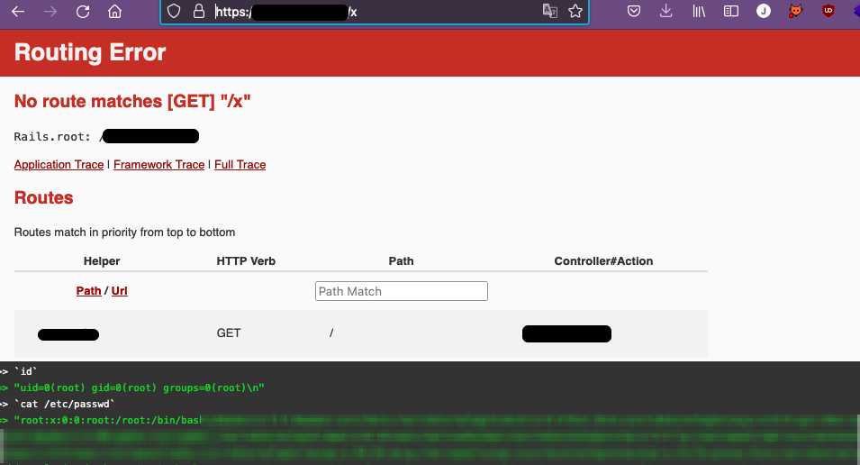

I originally wanted to name this article "The RCE that everyone missed", but since it was too "clickbait", this is the title you see now.

Why "The RCE that everyone missed"? That's what we'll see here. This article won't be very long and since there are no technical details, I'd rather focus on why I stumbled upon this RCE.

## The story

It's been many months now that I'm not very active in bugbounty, I haven't given up but in fact I devote my free time to the development of my own recon framework.

I'm currently on the 3rd iteration, which I'm really starting to like. At the end of this pipeline, I asked myself if I should integrate Nuclei.

Although it is a great tool, I have one complaint about it, the lack of testing on templates. This results in many templates that either:

 - Who doesn't even start
 - Does not perform a consistent check against the vulnerability (false negative)
 - Templates that often produce false positives

As I was undecided on the use of Nuclei, I decided to sort out all the templates (or at least a big part of them) so that what is executed corresponds to my use. After some time I excluded about 600 templates.

Either for the reasons mentioned above or because they do not correspond to what I am looking for / wish to discover

Disclaimer : _This seems to be a criticism of Nuclei, despite the concerns mentioned above, it is an incredible tool that has really changed the game. The ProjectDiscovery team provides several incredible tools, they are active and quickly take into account the issues raised. All this without expecting any counterpart from those who use their tools._

Anyway, to get back to the basic story, at one point I stopped on the [Rails Debug Mode Enabled](https://github.com/projectdiscovery/nuclei-templates/blob/52f92b91a25a2672ff5bed2e9bba1d9761f31099/exposures/logs/rails-debug-mode.yaml) template.

A template considered medium, with good reason, but as I use Ruby On Rails a lot, I know that when I set up an environment, there is also a particular gem called '[Rack Mini Profiler](https://miniprofiler.com/)', which is installed and activated and which, in its basic use allows to display information on the performance of page loads, SQL queries etc... but when is misconfigured allows access to environment variables and other secrets stored in memory.

From a medium template, a high / critical vulnerability can be discovered. So I was curious to see if I could discover a target in debug mode via this template.

My recognition base was still empty at this time, then I had to choose a program to test that. I've chosed a public program with a large scope, this one has received many reports and it has been a bit talked about when it was released and I know that many hunters had a look at it. For my part I had taken a quick look at it, but I had not come up with anything.

And for the occasion, a real stroke of luck, my recon' phase ends, Nuclei starts, and I receive an alert telling me that the ruby debug mode template has been found on a subdomain ! I quickly opened the URL, the debug mode is well activated but unfortunately the gem 'mini profiler' does not seem to be present or not activated.

And I remember visiting this domain and testing some features that seemed interesting. Except that I had missed, as well as all the other hunters who visited this domain, something important.

There was a ruby console at the bottom of the page which allows ... to execute ruby code. I simply type `id` and I get the return of the command, and voila.

## Conclusion

A simple but critical bug, after sending my report, it was quickly taken into account by the team and the next day the vulnerability was fixed. This little story taught me that it is sometimes better to trust your instincts and try to satisfy your curiosity than to expect magical results by using the same tools as everyone else.

Especially since this discovery finally put me on the track of another vulnerability much more technically interesting that I am investigating at the time I write these lines ;)

P.S : At the time of publishing this article, the previous lines have led me to a new RCE of which I hope to publish a new article soon after approval of the program
