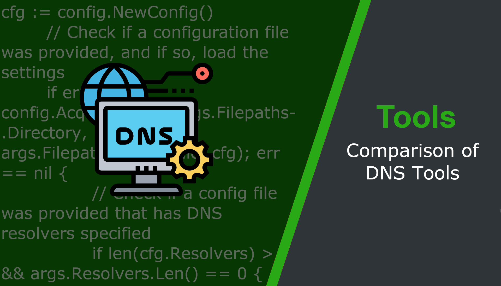
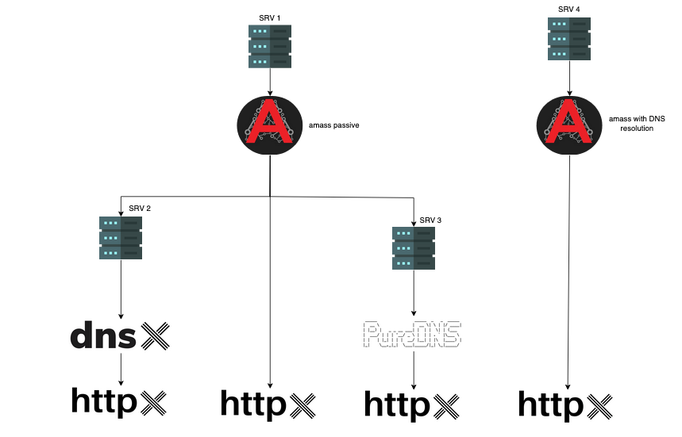

## The Story

[EDIT 26/04/22] - I added a note on my personal conclusion about Amass with a note from a conversation with Caffix about why Amass is slower than the others

---

Hi everyone,
I recently came across this tweet which immediately intrigued me because I also observed that I was losing valid domains with PureDNS.


I had done some tests (not very thorough) 8 months ago on different tools and I had concluded at that time that PureDNS was the best solution. However, since then the tools have received various improvements and the main reason that pushed me to redo this test is that Amass has completely revised its DNS resolution and as it is one of my favorite tools I had to test that.

This filtering step seems to me particularly important because currently many hunters use the same tools and therefore obtain the same results.
So I prefer to concentrate on the processing of these results (which is underestimated in my opinion) in order to improve my recon and for that I need the cleanest possible base result.

_Note : This is obviously a personal opinion because others, like Corben Leo which has nothing to prove has a completely different methodology ([see here](https://twitter.com/hacker_/status/1517907518604861440)) which works great for him._

But for me it's too much time consuming, I try to have a good balance between time / costs / quality of results

## The test

For this test I used the following tools:
* [HTTPX](https://github.com/projectdiscovery/httpx) v1.2.1
* [Amass](https://github.com/OWASP/Amass) v3.19.2
* [DNSX](https://github.com/projectdiscovery/dnsx) v1.1.0
* [PureDNS](https://github.com/d3mondev/puredns) v2.0.1

All installed on the same base namely a VPS with Ubuntu 22.04. For the tests I used the following protocol:



Which can be translated into:
  * Server 1 takes care of the passive collection of subdomains via Amass
    * On this same server I launch HTTPX directly on the results to have the subdomains reachable
  * On server 2 I use DNSX then HTTPX
  * On server 3 I use PureDNS then HTTPX
  * On server 4 I use directly Amass with its own resolution and I also use HTTPX at the end

I also used the same resolver list for all tools : [Proabiarl - Fresh Resolvers](https://github.com/proabiral/Fresh-Resolvers/blob/master/resolvers.txt)

The harvesting step is not really important here, it is far from being exhaustive because the only API key I used in Amass is the one from SecurityTrails, the important thing was only to have exactly the same base between all tools.

I also used different servers each time for the simple reason that if you run several DNS resolutions on a large number of invalid domains, you will get less and less results.

For this test I used the following domains:
  * uber.com
  * ford.com
  * sony.com
  * lazada.com
  * facebook.com

## Personal conclusion on the results

Before you read the results, I wanted to share my personal opinion on these results.

Firstly it would certainly have to be more thorough / exhaustive via port scanning and/or using HTTPX on many more ports to increase the false positive detection attempt. But I figured that wouldn't really change the result, I wanted to have an overall idea of which tool to use in my case.

* **Amass** with DNS resolution is the tool that seems to offer the best results, moreover it offers additional information that can be interesting (such as the target IP) for post-processing as well as a JSON output. However this one is extremely slow ... for Facebook the scan lasted 25 hours !
    * _**[EDIT 26/04/22] - Interesting notes from Caffix :** When DNS throttling slows down the responses, other tools can just drop the requests and potentially lose legitimate names. Amass slows down the requests and attempts to obtain the results, which takes longer, sometimes creating problems with targets that have strong throttling policies. Amass could make it possible to drop the requests as well by exposing a few additional arguments related to DNS but the Amass objective has always been in-depth attack surface mapping._
  * In passive mode only + HTTPX is very fast but it is also the method with the most false positives
* **DNSX** seems to be the tool with the most false positives but it is fast and like Amass it offers additional domain information and JSON output
* **PureDNS** is also fast and seems to offer good results (not as good as Amass but better than DNSX), however it does not offer additional information or JSON output. Something to take into account here as well is that the tool doesn't seem to receive any updates at the moment compared to the other two :'(

So there is no right or wrong choice here I think, just a choice that must fit your pipeline and methodology.

## Compilation of results

```
The HTTPX commands was always the same :
  - httpx -l {domain}.txt -o {domain}_httpx.txt

======== STATISTIQUES UBER.COM
=== Subdomain harvesting
  - amass enum -passive -config config.ini -d uber.com -o uber.txt
    - 2579 domains
    - 437 after httpx

=== Filtering step
  - amass enum -config config.ini -d uber.com -trf resolvers.txt -o uber.txt
    - 575 domains
    - 438 after httpx

  - dnsx -l uber.txt -o uber_dnsx.txt - r resolvers.txt
    - 568 domains
    - 436 after httpx

  - puredns resolve uber.txt -r resolvers.txt -w uber_puredns.txt
    - 571 domains
    - 435 after httpx

======== STATISTIQUES FORD.COM (Has multiples wildcards)
=== Subdomain harvesting
  - amass enum -passive -config config.ini -d ford.com -o ford.txt
    - 15554 domains
    - 3474 after httpx

=== Filtering step
  - amass enum -config config.ini -d ford.com -trf resolvers.txt -o ford.txt
    - 12945 domains
    - 3543 after httpx

  - dnsx -l ford.txt -o ford_dnsx.txt - r resolvers.txt
    - 11550 domains
    - 3462 after httpx

  - puredns resolve ford.txt -r resolvers.txt -w ford_puredns.txt
    - 10719 domains
    - 3339 after httpx

======== STATISTIQUES SONY.COM (Has multiples wildcards)
=== Subdomain harvesting
  - amass enum -passive -config config.ini -d sony.com -o sony.txt
    - 19539 domains
    - 557 after httpx

=== Filtering step
  - amass enum -config config.ini -d sony.com -trf resolvers.txt -o sony.txt
    - 1820 domains
    - 572 after httpx

  - dnsx -l sony.txt -o sony_dnsx.txt - r resolvers.txt
    - 1771 domains
    - 555 after httpx

  - puredns resolve sony.txt -r resolvers.txt -w sony_puredns.txt
    - 1782 domains
    - 553 after httpx

======== STATISTIQUES LAZADA.COM (Has multiples wildcards)
=== Subdomain harvesting
  - amass enum -passive -config config.ini -d lazada.com -o lazada.txt
    - 5315 domains
    - 257 after httpx

=== Filtering step
  - amass enum -config config.ini -d lazada.com -trf resolvers.txt -o lazada.txt
    - 325 domains
    - 118 after httpx

  - dnsx -l lazada.txt -o lazada_dnsx.txt - r resolvers.txt
    - 1485 domains
    - 220 after httpx

  - puredns resolve lazada.txt -r resolvers.txt -w lazada_puredns.txt
    - 484 domains
    - 210 after httpx

======== STATISTIQUES FACEBOOK.COM (Has multiples wildcards)
=== Subdomain harvesting
  - amass enum -passive -config config.ini -d facebook.com -o facebook.txt
    - 25050 domains
    - 11983 after httpx

=== Filtering step
  - amass enum -config config.ini -d facebook.com -trf resolvers.txt -o facebook.txt
    - 16796 domains
    - 10410 after httpx

  - dnsx -l facebook.txt -o facebook_dnsx.txt - r resolvers.txt
    - 17931 domains
    - 11785 after httpx

  - puredns resolve facebook.txt -r resolvers.txt -w facebook_puredns.txt
    - 16246 domains
    - 10098 after httpx
```
