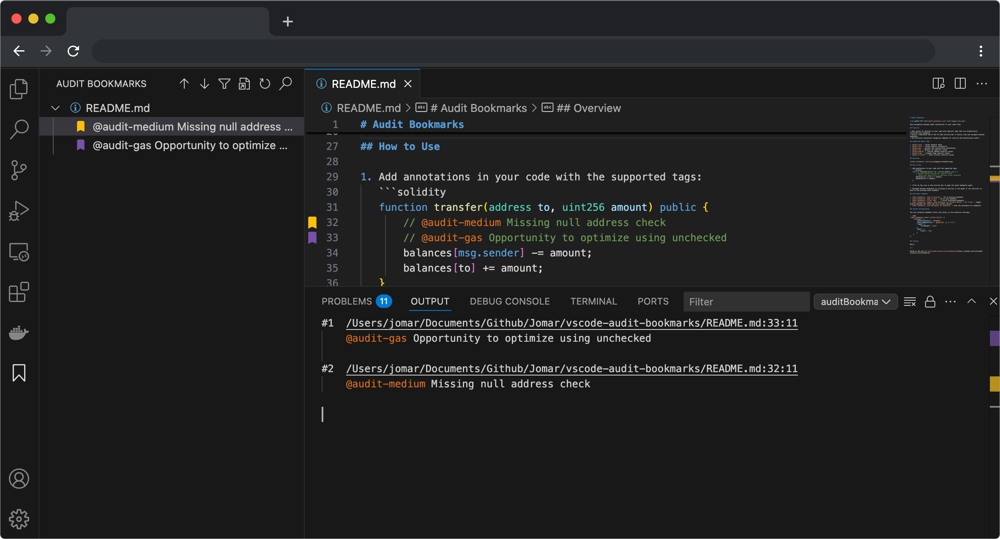
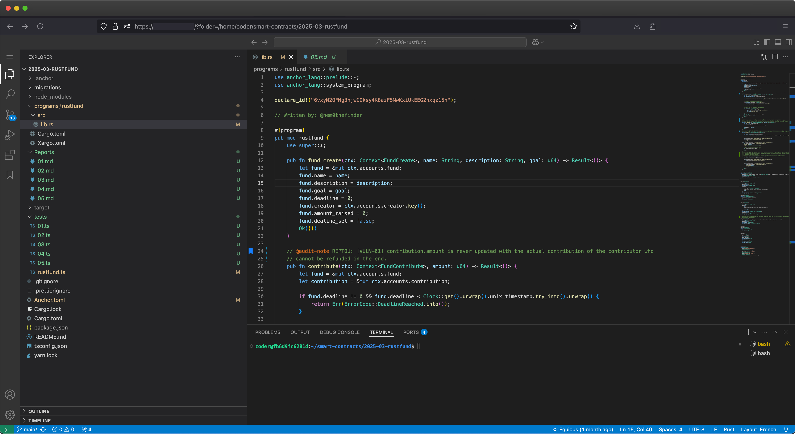

In cybersecurity, collaboration is essential, this ensures that multiple perspectives and expertise converge to uncover vulnerabilities more effectively, where overlooking even small issues can lead to significant vulnerabilities. Having a consistent, shared environment for team members helps eliminate friction, improves efficiency, and greatly reduces the infamous "works on my machine" problem.

In this article, we'll explore how to set up a collaborative environment for code auditing and in particular smart contract auditing that supports both Ethereum and Solana ecosystems, using Docker and VS Code.

_Note: the same environment could be replicated for any traditional code audit._

## The Challenge of Collaborative Auditing

In my opinion, the main problem with code audit collaboration lies in making the information available. Ideally, you should be able to access all information without having to switch applications.

When multiple tools or applications are used, notes may become redundant, quickly making the information outdated.

To address these challenges, we'll use two open-source projects:

1. [VSCode Audit Bookmarks](https://github.com/JoshuaMart/vscode-audit-bookmarks) - A VS Code extension for annotating and tracking audit findings
2. [CodeServer](https://github.com/0xWithdrawers/CodeServer) - A Docker environment based on [VS Code in the browser](https://github.com/codercom/code-server) with pre-configured tools for smart contract development and auditing



_Note : [VSCode Audit Bookmarks](https://github.com/JoshuaMart/vscode-audit-bookmarks), is based on the work of [tintinweb](https://github.com/tintinweb/vscode-inline-bookmarks)_

Let's first dive into how annotations can enhance your auditing process with VSCode Audit Bookmarks.

## Part 1: VSCode Audit Bookmarks

The Audit Bookmarks extension transforms VS Code into a powerful smart contract auditing tool by allowing you to:

- Tag code with audit annotations that automatically generate bookmarks
- Categorize findings by severity (critical, high, medium, low) and type (gas optimization, notes)
- Navigate between findings easily through a dedicated sidebar

**Annotation Types :**

The extension supports various annotation tags that are color-coded for quick visual reference:

- `@audit-note` and `@audit-info` (blue) - For general notes and information
- `@audit-gas` (purple) - For gas optimization suggestions
- `@audit-low` (green) - For low severity issues
- `@audit-medium` (yellow) - For medium severity issues
- `@audit-high` (orange) - For high severity issues
- `@audit-critical` (red) - For critical severity issues

**Usage Example :**

Here's how you can annotate Solidity code during an audit:

```solidity
function transfer(address to, uint256 amount) public {
    // @audit-medium Missing null address check
    // @audit-gas Opportunity to optimize using unchecked
    balances[msg.sender] -= amount;
    balances[to] += amount;
}
```

These annotations will appear in the sidebar, making it easy for you and your team to track and navigate between findings.

_Note : The extension is based on the work of [tintinweb](https://github.com/tintinweb/vscode-inline-bookmarks) and can be modified to be more generic/adapted to a code audit other than web3_

Once you have a solid annotation system in place, the next step is ensuring your team has unified access to a consistent environment, which we'll cover next.

## Part 2: Collaborative Docker Environment

The CodeServer repository provides a Docker environment specifically designed for smart contract auditing. It includes:

**Key Features :**

- **VS Code in the browser** - Using Code Server, which allows multiple team members to access the same environment
- **Cross-chain support** - Tools for both Ethereum (Foundry) and Solana (Anchor) development
- **Security tools** - Pre-installed static analyzers like Slither
- **Consistent tooling** - Same versions of all dependencies for all team members

Below is a Dockerfile example demonstrating the installation of essential tools (Ethereum & Solana support, static analysis tools, etc.):

```Dockerfile
FROM --platform=linux/amd64 codercom/code-server:4.98.2

ARG HOME="/home/coder"

# Install the necessary dependencies
RUN sudo apt-get update && \
    sudo apt-get install -y \
    libssl-dev \
    pkg-config \
    libudev-dev \
    python3 \
    python3-pip \
    pipx \
    && sudo rm -rf /var/lib/apt/lists/*

# Install Rust, Solana CLI & Anchor
RUN curl --proto '=https' --tlsv1.2 -sSf https://sh.rustup.rs | sh -s -- -y
RUN sh -c "$(curl -sSfL https://release.anza.xyz/stable/install)"

ENV PATH="$PATH:$HOME/.cargo/bin:$HOME/.cargo/env:$HOME/.local/share/solana/install/active_release/bin"
RUN cargo install --git https://github.com/coral-xyz/anchor --tag v0.31.0 anchor-cli

# Install NodeJS & Yarn
RUN curl https://deb.nodesource.com/setup_22.x | sudo bash
RUN sudo apt-get install -y nodejs && \
    sudo npm install --global yarn

# Install Slither
RUN pipx install slither-analyzer

# Install Foundry
RUN curl -L https://foundry.paradigm.xyz | bash && \
    bash -c "source $HOME/.bashrc" && /home/coder/.foundry/bin/foundryup

ENV PATH="$PATH:$HOME/.local/bin"

# Download the VSCode Audit Bookmarks extension
RUN cd /home/coder/ && \
    wget https://github.com/JoshuaMart/vscode-audit-bookmarks/releases/download/v0.1.0/vscode-audit-bookmarks-0.1.0.vsix
```

Build an run the container :

```bash
docker build -t code-audit .
docker run -p 8080:8080 -v $(pwd):/home/coder/project -e PASSWORD=your_secure_password code-audit --auth password
```

## 3. Configuring for Team Use

For a production setup, you might want to:

- Deploy the container on a cloud server for team access
- Use proper authentication methods
- Set up persistent storage for audit findings
- Configure automated backups

Here's the docker-compose file I use in production, for example :

```Dockerfile
services:
  code-server:
    build: .
    networks:
      - traefik-global-proxy
    volumes:
      - ./smart-contracts/:/home/coder/smart-contracts
    environment:
      - PASSWORD=your_super_password
      - DISABLE_TELEMETRY=true
      - DISABLE_UPDATE_CHECK=true
    command: --auth password
    labels:
      - "traefik.enable=true"
      # HTTPS Router
      - "traefik.http.routers.codeserver.rule=Host(`code.domain.tld`)"
      - "traefik.http.routers.codeserver.entrypoints=websecure"
      - "traefik.http.routers.codeserver.tls.certresolver=letsencrypt"
      - "traefik.http.services.codeserver.loadbalancer.server.port=8080"

networks:
  traefik-global-proxy:
    external: true
```

As VSCode web works in the same way as the Desktop version, all you have to do is clone the repository of the code to be audited directly from a terminal into VSCode and open the folder.



## Conclusion

A collaborative audit environment can significantly enhance the effectiveness of code auditing. By combining the power of VSCode Audit Bookmarks for annotation and the consistency of a Docker-based environment, audit teams can work together seamlessly across different blockchain ecosystems.

This approach not only improves the quality of audits but also makes the audit process more efficient and reproducible. As the complexity of smart contracts continues to grow, having a robust collaborative workflow becomes increasingly important for identifying and mitigating security vulnerabilities.
