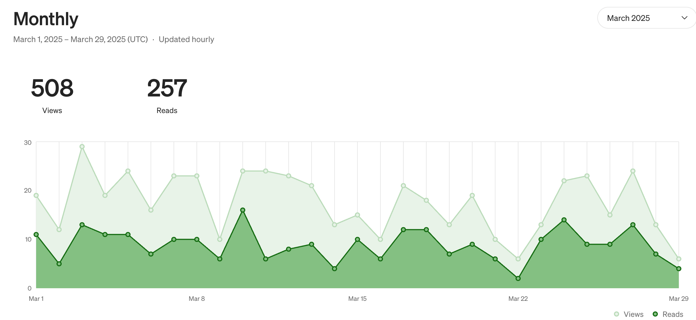

After experimenting with multiple blogging platforms over the past seven years, I've finally settled on a solution that works for me. Here's my journey through the blogging ecosystem and what I've learned along the way.

## My Blogging Journey

I created my first blog back in 2018. My inaugural article covered setting up a complete authentication system on Laravel 6 - quite technical, but reflective of my interests at the time.

Over the years, I've struggled with two main challenges:
1. Deciding which platform to use and sticking with it
2. Determining a consistent editorial line or theme

This indecision led me through a winding path across various platforms:

* **2018**: Self-Hosted WordPress
* **2019-2020**: Hugo on GitHub Pages
* **2021**: Experiment with Medium
* **2021**: Direct publishing via GitHub Pages (without Hugo)
* **2022-2023**: Back to Hugo
* **2023-2024**: Migration to Substack
* **2025**: Full circle back to Hugo with GitHub Pages

**The Mistake of Deleting Old Content**

One regret I have is not preserving my older articles. I deleted many early posts, believing they no longer aligned with my evolving content direction. This was a mistake. Those articles represented my learning journey and could have provided value to others facing similar challenges.

## Today's Blogging Landscape (2025)

The blogging ecosystem in 2025 offers abundant solutions for content creators with different needs:

**Medium & Substack: Hassle-Free Publishing**

Platforms like Medium and Substack eliminate many technical headaches from blogging. I tested both because they promised greater content visibility - and when you're blogging, being read is a primary goal.

**The Cost Factor**

* **Substack**: Allows custom domains for a one-time fee of $50
* **Medium**: Requires $50 annually for the same feature

For a casual blogger like me with just a few articles, Medium's recurring cost didn't seem justifiable.

**Built-in Analytics**

A significant advantage of these platforms is their integrated analytics (available even on free tiers). Self-hosted solutions like Hugo require third-party tools such as Google Analytics to track readership.

## Why I Returned to Hugo + GitHub Pages

After all my platform-hopping, I've settled back on Hugo hosted via GitHub Pages because:

1. **Custom Domain Support**: GitHub Pages offers free custom domain integration
2. **Design Control**: I wanted more flexibility in my blog's appearance
3. **AI-Assisted Customization**: With today's AI tools, modifying existing themes to match my vision has become remarkably simple

**Streamlined Workflow**

The deployment process with GitHub Pages and GitHub Actions has become extremely straightforward:

1. Write a new article in Markdown
2. Push to my repository
3. GitHub Actions automatically builds and deploys the updated site

This workflow eliminates concerns about:
* Manual deployment steps
* Backups (everything is versioned in Git)
* Security vulnerabilities (no dynamic code like WordPress)
* Server maintenance (static sites are simple)

**Analytics Without Intrusion**

For visitor tracking, I use a self-hosted instance of Umami - a privacy-focused analytics solution that doesn't compromise user experience.

**Getting Started with Hugo & GitHub Pages**

For those interested in trying Hugo with GitHub Pages, I highly recommend checking out this comprehensive guide: [Create a Static Blog with Hugo](https://www.testingwithmarie.com/posts/20241126-create-a-static-blog-with-hugo/). This article walks you through the entire process from installation to deployment, making it easy even for beginners to get started with this powerful combination.

## Recommendations for 2025

**Do I recommend Hugo?** Absolutely - if you want a personalized blog without excessive technical overhead.

**For whom is Hugo ideal?** Those comfortable with basic Git operations who desire more design control and don't mind a slightly steeper initial learning curve.

**For pure simplicity**: If you just want to focus on writing without worrying about technical details, platforms like Medium remain excellent choices.

The perfect blogging platform depends entirely on your priorities: simplicity, customization, ownership, or visibility. In 2025, we're fortunate to have options that cover the entire spectrum.
