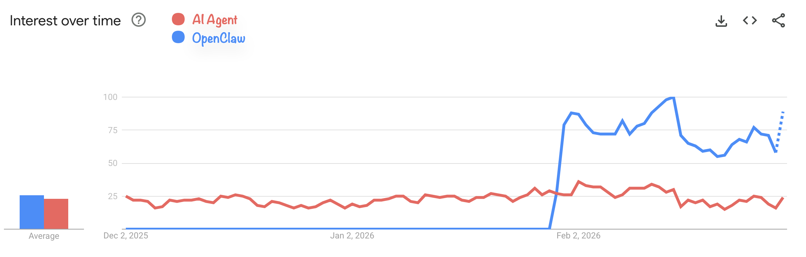

AI agents aren't new to me. I had already experimented with frameworks like LangChain, CrewAI, and ruby_llm, and I found them frustrating — overly complex to set up, slow to produce results, and ultimately disappointing. Tool use in particular felt unreliable, and outcomes varied too much depending on factors I couldn't always control. I moved on.

Then OpenClaw happened.

## OpenClaw changed the conversation

In late January 2026, OpenClaw crossed 100,000 GitHub stars in under a week. Today it sits at over 240,000. That kind of traction is hard to ignore — not because of what the project itself does, but because of what it signals: AI agents finally became accessible enough for a mainstream developer audience to care about.

And yet, if you look at Google Trends, interest in "AI agents" as a broader topic didn't really follow. The hype was mostly concentrated around the OpenClaw name itself, not the underlying concept.

That asymmetry is interesting. OpenClaw didn't invent AI agents — it just made them approachable. Which made me think: if the tooling finally got good enough, maybe it was worth taking a second look.

My usual approach: let things settle, filter the noise, then actually test once I have enough perspective. So that's what I did.

## Why I didn't stick with OpenClaw

I tried OpenClaw. It's impressive, but it's also a massive project — fast-moving, increasingly complex, and hard to reason about as a whole. For my use case, that was a dealbreaker. I don't want to depend on something I can't fully understand or maintain.

While exploring alternatives, I came across [Nanobot](https://github.com/HKUDS/nanobot) — a lightweight AI assistant inspired by OpenClaw, built in roughly 4,000 lines of Python. The pitch was simple: ~90% of OpenClaw's functionality, ultra-fast startup, and code that's actually readable enough to audit.

That last part mattered to me. I took the time to go through the code carefully — and in the process, I found a vulnerability. I reported it to the project. It was fixed and published as [CVE-2026-2577](https://www.tenable.com/security/research/tra-2026-09). The fix landed faster than almost any other responsible disclosure I've been part of at work.

That speed of response was a good sign. But it also surfaces a real tension in open-source projects at this scale.

## The pressure on open-source maintainers

OpenClaw's success pushed a lot of attention onto adjacent projects like Nanobot. I submitted two PRs to the repo — but before opening them, I checked whether similar work already existed. It did, in both cases. And not just once: I found several duplicate PRs covering the same ground, sometimes with slightly different approaches or scope.

That kind of duplication is a symptom of rapid growth. When a project gains visibility overnight, contributors flood in without full context, and maintainers end up spending more time triaging than building. One of my PRs had a near-duplicate, but with a different approach and a different end goal — the kind of subtle distinction that's easy to miss under pressure, and that takes real time to evaluate properly.

It's a structural problem. And it was part of why I eventually stopped waiting on upstream changes and started thinking about building my own thing.

## From using agents to orchestrating them

Using a single agent wasn't really what I wanted. My actual goal was an interface to pilot and coordinate multiple agents — and that led me to start building [Nanofleet](https://github.com/NanoFleet/nanofleet).

Part of the thinking behind that came from recent research suggesting that a small model with the right specialization can approach the performance of a much larger (and more expensive) one on targeted tasks (see [this paper](https://arxiv.org/pdf/2602.12670)). If that's true, the interesting design space isn't "use the biggest model" — it's "use the right model for the right task, and coordinate them well."

Nanofleet started as a small experiment and became a real learning environment — I understood LLMs, tool use, and the agent ecosystem much better by building it than I ever did by reading about it.

But Nanobot wasn't evolving fast enough to keep pace with what I needed. I had a monkey-patched local fork that broke with every upstream update. I had open PRs sitting idle. And I was spending more time on compatibility than on actual features.

The maintainer takes the time to look, question, and suggest, which means that the project progresses properly, in the right direction, but slowly. That friction eventually pushed me to ask a different question: is it actually hard to build your own agent anymore?

## Building my own agent in under 72 hours

Spoiler: it's not.

### Day 1 — Choosing the right foundation

There are several solutions/SDKs that I have looked at, but here are the two main ones that I have tested and really explored:

- **Claude Agent SDK** (Anthropic): Tight integration with Anthropic's models, and the only SDK that lets you use your OAuth token from a Claude subscription. But that's also its constraint — you're locked to Anthropic's models.
- **Vercel AI SDK**: Simple, provider-agnostic, works with Anthropic, Gemini, OpenRouter, and others. No subscription lock-in.

I ran experiments with both. The takeaway: a working agentic loop takes about 60 lines of code. Add memory, multi-provider support, tooling, and web search, and you're around 140 lines. The basic mechanics are genuinely not complicated.

I ended up going with the Vercel AI SDK — but not for the SDK itself. I chose it because of [Mastra](https://mastra.ai), a framework built on top of it that solves the problem I care about most: **memory**.

#### Memory is the hard part

Almost every agent framework I looked at approaches memory the same way: a SQLite database plus something like a `MEMORY.md` file. It works well enough for simple cases — local-first, zero infrastructure, easy to inspect. OpenClaw itself uses this approach.

But it has real limits. When you start dealing with longer sessions, multiple concurrent conversations, or agents that need to retrieve semantically relevant context from past interactions, a flat file and a basic SQLite index start to show cracks. Most frameworks end up reinventing the same partial solutions — none of which come with proper benchmarks or a clear story about how they scale.

Good memory for an agent involves at least three distinct layers working together:

- **Message history**: recent turns, for conversational coherence
- **Working memory**: persistent structured data — user preferences, ongoing goals, known context
- **Semantic recall**: retrieval of relevant past exchanges based on meaning, not just recency

Getting all three right simultaneously, without adding operational overhead, is genuinely difficult. And most frameworks sacrifice at least one of them.

Mastra handles all three explicitly, with support for real databases (PostgreSQL, MongoDB, libSQL) rather than SQLite-only. It also introduces an "Observational Memory" layer — a background process that maintains a compressed observation log instead of raw message history, which is a much more practical approach for long-running agents. That's the kind of architectural thinking that saves you from rewriting your memory layer six months in.

The rest of Day 1 was spent writing a proper spec (1K+ lines) and a detailed TODO for the project.

### Day 2 — The actual build

The project was broken into 14 phases. Here's the full progression, measured in lines of code:

| Phase | Description | LOC |
|---|---|---|
| 0 | Project bootstrap | — |
| 1 | Core agent (minimal working loop) | 81 |
| 2 | Identity layer | 181 |
| 3 | Memory layer | 391 |
| 4 | Tools | 609 |
| 5 | MCP client | 684 |
| 6 | Skills | 828 |
| 7 | Scheduling | 872 |
| 8 | Usage & cost tracking | 1,099 |
| 9 | CLI channel (dev/testing) | 1,193 |
| 10 | Prompt caching optimization | 1,274 |
| — | Fixes & improvements | 1,312 |

By the end of Day 2, I had an agent that covered all my requirements — and then some — in under 1,500 lines of code. With just my Claude Code Pro subscription, I estimate the equivalent API usage to be around $85-$100.

One feature worth highlighting: the ability to run multiple independent conversation threads with the same agent. It sounds minor, but it means I can have one specialized agent and open separate conversations for different topics without polluting the context. For my use case, that matters.

I haven't had the opportunity to thoroughly test my own solution yet, so there are certainly bugs and features that are still missing, but based on the tests I've done, it already covers several of my needs.

### Day 3 — Integration and documentation

The least interesting day for this post. Mostly wiring the new agent into Nanofleet and writing documentation. No surprises.

## A note on prompt caching

Phase 10 in the build was prompt caching optimization, and it's worth explaining why I treated it as a dedicated phase rather than an afterthought.

In agentic workloads, you're making many API calls in sequence. Each call carries a system prompt — your agent's identity, instructions, and context — that doesn't change between turns. Without caching, you're paying full price for those tokens every single time.

With prompt caching enabled on Anthropic's API, cached tokens cost **90% less** than regular input tokens. A cache write costs 25% more than a standard input token, but that overhead pays for itself after roughly 7 cache reads. For a long-running session with dozens of turns, the math becomes very favorable very quickly.

Empirically, research on agentic workloads shows cost reductions of **41–80%** with proper caching strategies, with some benchmarks reaching 76% cost savings with negligible impact on output quality. Latency also improves significantly — up to 85% faster time-to-first-token for long prompts.

The practical implication: a model with prompt caching support can end up cheaper on a long session than a nominally cheaper model without it. Don't evaluate model costs on per-token price alone — evaluate them on the actual cost of your typical workload.

The implementation detail that matters: keep your system prompt stable and at the top of your context. Dynamic content (tool results, user messages) goes at the end. That placement is what allows the cache to hit reliably.

## Where this leaves things

Building a custom agent today is genuinely accessible. The mechanics are simple, the SDKs are mature, and a small codebase can cover most real-world needs. The argument for building your own rather than adopting an existing framework is stronger than it's ever been — especially because the space is moving fast enough that anything you adopt today may be superseded soon, and a small codebase you understand is much easier to migrate or extend than a large dependency you don't.

That said, there are real open problems. Multi-agent coordination — whether through subagents or peer collaboration — is still immature. The patterns aren't settled, and the tooling doesn't yet reflect how those systems should actually work. I already have a step on my TODO list that I still haven't done on this subject, because there are several possible implementations.

The bigger gap, in my opinion, is **benchmarking**. Right now there's no good way to evaluate agents against each other on specific capabilities. What's the success rate of agent A vs. agent B on this class of task? What's the cost-per-success ratio? How does model choice (with the right skills) affect outcomes on targeted workloads?

That's the direction I want to explore next — a system for benchmarking agents by capability profile, measuring the ratio of time, cost, and success rate across specific task types. If the small-specialized-model hypothesis holds, you need tooling to actually verify it. Something similar to [SkillsBench](https://www.skillsbench.ai/)

That feels like the interesting problem now.
